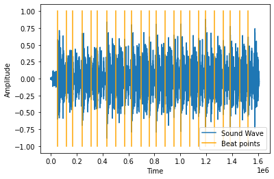
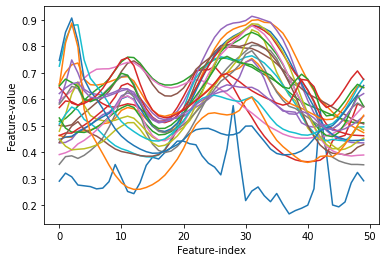
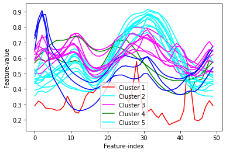

# MusicRemixer
[](https://musicremixer.netlify.app/)
[](https://musicremixer.herokuapp.com/)
[]("https://colab.research.google.com/gist/sudip-mondal-2002/9744e9ff0415ff6fbc8664473828444a/music_generator.ipynb")

## Using the API
* Endpoint+path : https://musicremixer.herokuapp.com/remix
* Method: POST
* Body: type/json, urls = array of string(url to a wav file)
```json
{
    "urls":[
        "https://file-examples-com.github.io/uploads/2017/11/file_example_WAV_1MG.wav"
    ]
}
```
* Return : Wav file(Remix music)
## Proposed Architecture of Model and Workflow
### Segregate the beats from the track
Using Dynamic programming, can separate the beats from each other. Beats are detected in three stages, following the method of [Ellis, Daniel PW. “Beat tracking by dynamic programming”](http://labrosa.ee.columbia.edu/projects/beattrack/). The stages are as following, 
1.	Measure onset strength
2.	Estimate tempo from onset correlation
3.	Pick peaks in onset strength approximately consistent with estimated tempo.
#### Implementation
```py
def beatExtractor(track,sr):
  tempo, beat_times = librosa.beat.beat_track(track, sr=sr,tightness=10,start_bpm=30, units='time')
  beat_points = beat_times*sr
  plt.plot(track)
  plt.xlabel("Time")
  plt.ylabel("Amplitude")
  for point in beat_points:
    plt.plot([point,point],[-1,1], color="orange")
  plt.legend(["Sound Wave","Beat points"])
  plt.show()
  beats = []
  for i in range(len(beat_points)):
    if(i==0):
      beats.append(librosa.effects.trim(track[:int(beat_points[0]-1)])[0])
    else:
      beats.append(librosa.effects.trim(track[int(beat_points[i-1]):int(beat_points[i]-1)])[0])
    if(i==len(beat_points)-1):
      beats.append(librosa.effects.trim(track[int(beat_points[i]):])[0])
  beats = np.array(beats)
  return beats
```
#### Results


### Extract the features from segregated beats
Extract the features to differentiate between the peculiarity of different beats in the music. To get the features, I have used the short time Fourier series transform (STFT). We know that any sound wave is sum of different sinusoidal wave which are Fourier series themselves. I have extracted 50 features from the beats according to the chromogram of the discrete Fourier series over short time span.

#### Implementation
```py
def featureExtractor(beats, sr, n_features):
  features =[]
  for beat in beats:
    beat_features_raw = librosa.feature.chroma_stft(y=beat, sr=sr,n_chroma=n_features)
    beat_features = []
    for raw in beat_features_raw:
      beat_features.append(sum(raw)/len(raw))
    features.append(beat_features)
  features = np.array(features)
  return features
```
#### Results


### Create clusters based on the extracted features
I have implemented K means clustering on the data. A cluster refers to a collection of data points aggregated together because of certain similarities. You’ll define a target number k, which refers to the number of centroids you need in the dataset. A centroid is the imaginary or real location representing the centre of the cluster. Every data point is allocated to each of the clusters through reducing the in-cluster sum of squares. In other words, the K-means algorithm identifies k number of centroids, and then allocates every data point to the nearest cluster, while keeping the centroids as small as possible. The ‘means’ in the K-means refers to averaging of the data; that is, finding the centroid.

#### Implementation
```py
def groupExtractor(features, beats, n_groups):
  if(len(features)!=len(beats)):
    raise ValueError("Error: beats and features mismatch")
  kmeans = KMeans(n_clusters=n_groups, init='k-means++', random_state=0)
  y_kmeans = kmeans.fit_predict(features)
  group_to_index = {}
  for i in range(len(y_kmeans)):
    group_to_index[y_kmeans[i]] = []
  for i in range(len(y_kmeans)):
    group_to_index[y_kmeans[i]].append(i)
  return (y_kmeans, group_to_index)
```

#### Results


### Generate new music from the beats
To generate the music, there is not a hard bound theory I have used till now, I just simply took a logical algorithm to build the music. At every beat, we will do a random check if the next beat will be the correct next beat as per the original music or it will be a random beat from the cluster of the current beat. So, the current track will be 1-2-3-4-2 as shown in the figure.


```py
for i in range(N_BEATS):
    nextTone = random.randint(0,TEMPERATURE)
    if(nextTone==0 and curr_beat<len(beats)-1):
      curr_beat+=1
    else:
      curr_beat = random.choice(group_to_index[curr_group])
      curr_group = groups[curr_beat]
    music.append(curr_beat)
```

## Final Results
* The notebook can be found in the [GitHub gist](https://gist.github.com/sudip-mondal-2002/9744e9ff0415ff6fbc8664473828444a).
* [Sample audio input taken](./Backend/tmp/temp.wav).
* [Generated audio from input](./Backend/tmp/remix.wav).

## Possible Upgradation further
Currently assembling the new track from the clustered data, is a random process, instead we can feed it into a LSTM neural network to generate the tone. It should give a better result than the current randomized process.


